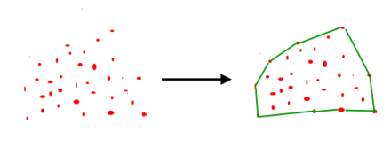
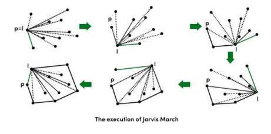

# ConvexHull

Convex Hull using Jarvis’ Algorithm or Wrapping Given a set of points in the plane. the convex hull of the set is the
smallest convex polygon that contains all the points of it.

The idea of Jarvis’s Algorithm is simple, we start from the leftmost point (or point with minimum x coordinate value)
and we keep wrapping points in counterclockwise direction.

## **Algorithm**:

    Step 1) Initialize p as leftmost point.
    
    Step 2) Do following while we don’t come back to the first (or leftmost) point.
    
        2.1) The next point q is the point, such that the triplet (p, q, r) is counter clockwise for any other point r.
        
            To find this, we simply initialize q as next point, then we traverse through all points.
            
            For any point i, if i is more counter clockwise, i.e., orientation(p, i, q) is counter clockwise, then we update q as i.
            
            Our final value of q is going to be the most counter clockwise point.
        
        2.2) next[p] = q (Store q as next of p in the output convex hull).
        
        2.3) p = q (Set p as q for next iteration).

## **Example**:

**Input**:

`(0,3), (2,2), (1,1), (2,1), (3,0), (0,0), (3,3)`

**Output**:

`(0, 3)
(0, 0)
(3, 0)
(3, 3)`
